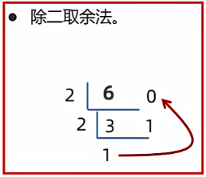
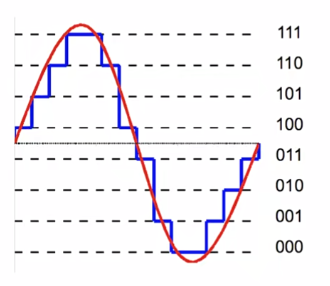
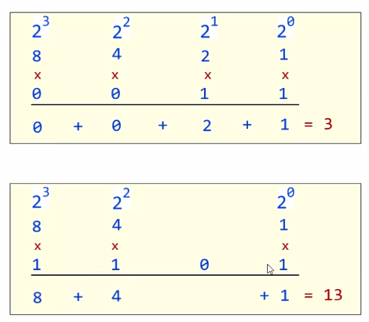
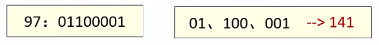
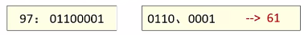
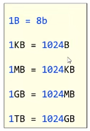
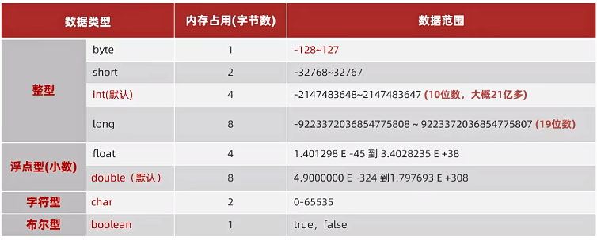
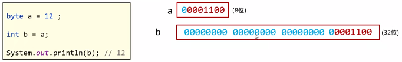
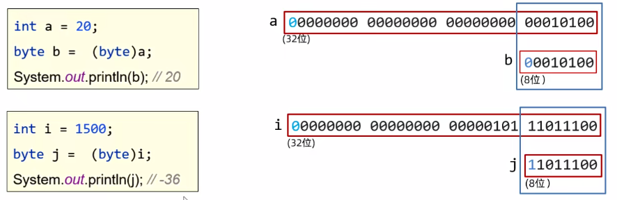

# 变量与转换

变量里的数据在计算机中的储存原理：

二进制：

只有0、1，按照逢二进一的方式表示数据。

十进制转二进制的算法：

比如求6的二进制数：

从下往上看余数，所以是110。

计算机中表示数据的最小单元：字节（byte，简称B）= 8个比特位（bit，简称b）——   8个二进制位组成。

字符（文本）在计算机中是如何存储的：

原理：把每个字符理解为一个数据（数字）来进行存储进计算机里——ASCII编码表。

ASCII编码表：即美国信息交换标准编码，规定了现代英语、数字字符和其它西欧字符对应的数字编号。

https://blog.csdn.net/jiayoudangdang/article/details/79828853——ASCII完整码表

图片数据（彩色图）在计算机中的存储：

图片就是无数个像素点组成的

每个像素点的数据：用0~255的三个数表示其颜色——XXX-XXX-XXX：分别表示红绿蓝。

声音数据在计算机中的存储：

二进制数转十进制数：

八进制、十六进制介绍：

为了便于观察和表示二进制，推出了八进制和十六进制。

每3位二进制作为一个单元，最小数是0，最大数是7，共8个数字，这就是八进制：

每4位二进制作为一个单元，最小数是0，最大数是15，共16个数字，依次用：0~9ABCDEF代表就是十六进制。

注：Java中支持书写二进制、八进制和十六进制的数据：

二进制：以0B（0b）开头。

八进制：以0开头。

十六进制：以0X（0x）开头。

在B（字节）的基础上，计算机发展出了KB、MB、GB、TB、.... 这些数据单位：

数据类型的分类：

基本数据类型：4大类8种

注：E -45表示前面数乘以10的负45次方、E +38表示前面数乘以10的38次方。

注：如果随便写一个整型字面量它默认是int类型，如果要让它默认为long类型——在后面加L或者l。

注：写一个小数字面量默认是double类型，如果希望是float类型——后面加个F或者f。

注：在字符定义中，有且只能有1个字符。（必须有且只能有1个字符）

引用数据类型：

String：可用于存储字符串。

自动类型转换：

类型范围小的变量，可以直接赋值给类型范围大的变量。

自动类型转换在计算机中的执行原理：

表达式的自动类型转换：

在表达式中，小范围类型的变量，会自动转换成表达式中较大范围的类型，再参与运算。

注：

表达式的最终结果类型由表达式中的最高类型决定。

在表达式中，byte、short、char是直接转换成int类型参与运算的。

用最高类型定义才不会出bug。

强制类型转换：

类型范围大的数据或者变量，直接赋值给类型范围小的变量，会报错。

所以，不能直接赋值。

强行将类型范围大的变量、数据赋值给类型范围小的变量的正确方法：

例：

int a = 20;

byte b = (byte)a;

int(变量1的数据类型) a(变量1) = 20(变量1数值);

byte(变量2的数据类型) b(变量2) = (byte)a(变量1)；

注：(byte)a，括号中的byte指的是要强制转换的类型，因为需要赋值给(b)变量2的数据类型为byte，所以这里为byte。

强制类型转换在计算机中的执行原理：

注：

在计算机存储整数数据中最高位通常表示正负。

强制类型转换可能造成数据(丢失)溢出。

浮点型强转成整型，直接丢掉小数部分，保留整数部分返回。