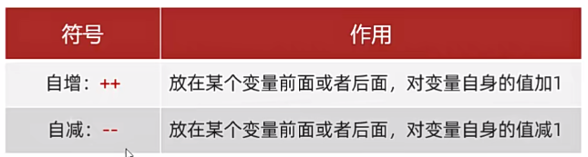
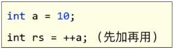
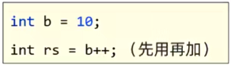
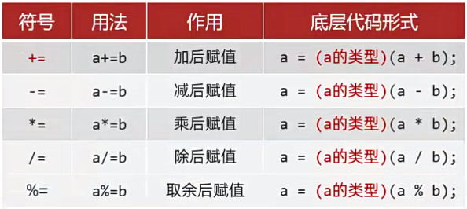

# 运算符

基本的算术运算符：

注：

例：

int a = 5;

int b = 2;

System.out.println(a/b);

打印结果为：2。

如果要打印结果为小数则需要把：

System.out.println(a/b)改为System.out.println(1.0*a/b)

打印结果为：2.5。

总之就是运算数据中有小数，结果就会有小数。

“+”符号与字符串运算的时候是用作连接符的，其结果依然是一个字符串。

"abc" + 5 ---> "abc5"

比如：

int a = 5;

int b = 3;

打印：5+3=8——System.out.println("5+3="+(a+b))

结果为：5+3=8

其中"5+3"(双引号)里面的是字符串，直接输出(不作任何改变)，接着的+(加号)，因为前面有字符串，所以在此为连接符，连接上(a+b)，又因为这里面的+(加号)有()(括号)与外面运算隔开，运算没有字符串，所以在此用作运算符。

如果两个整数做除法，其结果一定是整数，因为最高类型是整数。

自增自减运算符：

注意：

++、--只能操作变量，不能操作字面量。

++、--如果不是单独使用(如在表达式中、或者同时有其它操作)，放在变量前后会存在明显区别

例1：放在变量的前面，先对变量进行+1、-1，再拿变量的值进行运算

​        

例2：放在变量的后面，先拿变量的值进行运算，再对变量进行+1、-1

​          

基本赋值运算符

就是“=”，从右往左看。

扩展赋值运算符：

注：

扩展的赋值运算符隐含了强制类型转换。